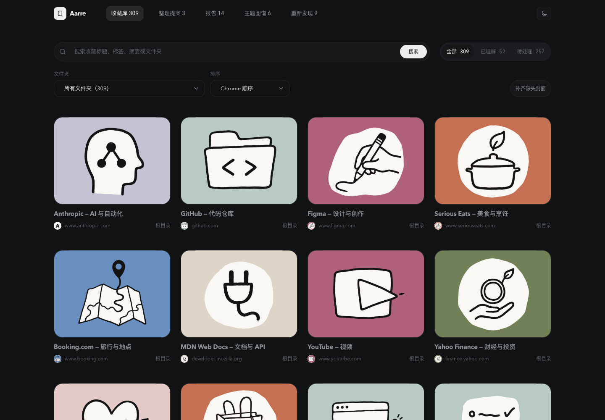
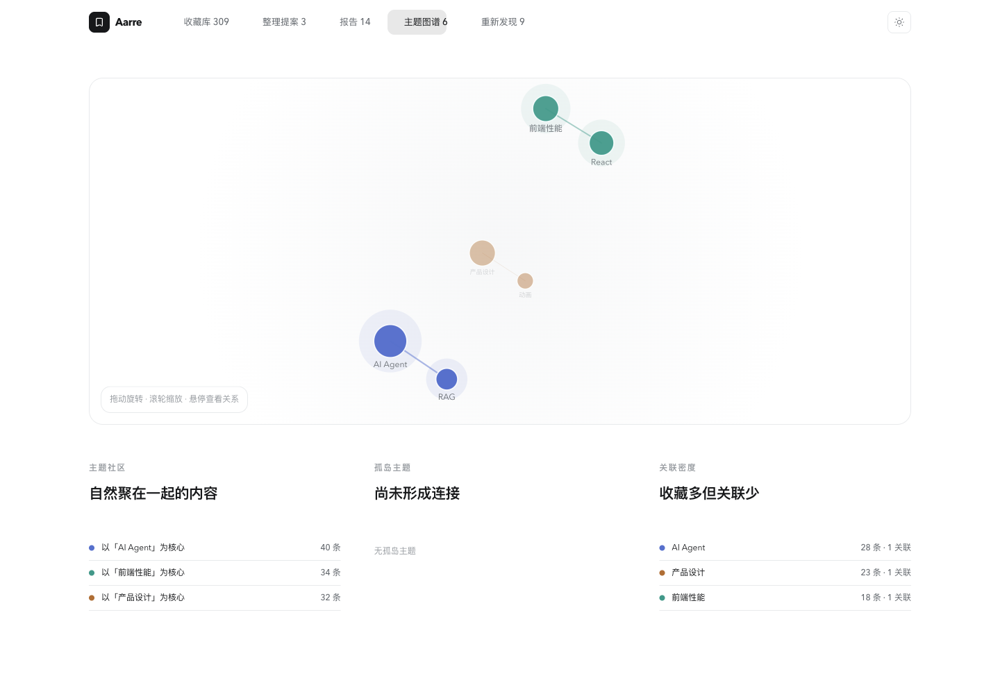
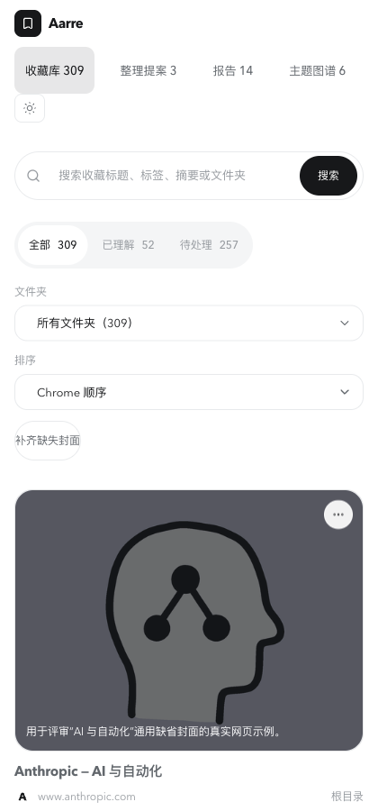

# Aarre 全面审计 · 2026-09-09

本报告是 **0.5.73 当前源码、构建、自动化及本轮浏览器走查**的审计结果。它取代旧审计中的“当前状态”判断，不取代历史设计决策。统一进展仍维护在根目录 [AGENT_PROGRESS.md](../AGENT_PROGRESS.md)。

## 1. 结论与当前进展

**主要功能框架已具备，但目前还不适合宣布“稳定性已完成、可以放心依赖云端备份”。应先修同步一致性与异常恢复，再做视觉精修。**

最需要处理的不是外观：增量同步可能跳过未保存的数据；更新与删除混合时可能恢复已删除的智能记录；上传旧响应会回退新备注；旧设备可能把旧封面重新上传；部分上传失败仍显示“已同步”。这些情况已有本轮独立复现，不能由旧版全绿测试抵消。

视觉基础较好：中性界面、统一手绘封面、清楚的页面导航、日夜主题和原生收藏编辑之间形成了连贯的产品语言。主要短板是小字过浅、窄窗口操作区占位较多、图谱信息难操作，以及恢复入口不完整。没有必要因为这轮审计推翻现有视觉体系。

### Git 与版本

- 开工时工作区干净，分支为 `main`。
- 已执行 `git fetch --prune origin`、`git pull --ff-only origin main`；结果为 **Already up to date**。
- 本地及远端 `origin/main` 均为 `cc352cfb16b30fb16b84eec9dff74aa1ea23b8b8`，提交标题 `fix: polish bookmark interactions and agent links (0.5.73)`。
- 扩展源码与本轮 `dist/manifest.json` 均为 **0.5.73**；服务端源码为 **0.1.14**。生产正在运行的准确服务端版本未在本轮核对。
- 之前 T-01～T-20、T-14c 等重构已有实现。此次发现的是当前实现中的遗漏，不能据此把整套历史重构重新列为未完成。
- 本轮只增加审计文档、截图和独立复现材料，并更新进展文档；没有修改产品功能、提交、推送或发布。

## 2. 验证范围与证据边界

| 范围 | 本轮结果 | 能证明什么 / 不能证明什么 |
| --- | --- | --- |
| 根目录 `npm run check` | **450/451 项通过，86/87 文件通过**；Node、设计 token、类型检查通过 | 唯一原有测试失败是固定日期已过期，见 A13；整条 check 没有全绿，也因失败未进入其中的 build 步骤 |
| 单独 `npm run build` | **通过**，全部输出 JavaScript 语法检查通过 | 当前源码可生成扩展产物；不等于已安装 Chrome 正常运行 |
| 后台产物 | `background.js` **329,976 bytes**，低于项目 330,000 bytes 门槛 | 仅剩 24 bytes 余量，后续改动容易触发门槛；这不是用户性能指标 |
| 服务端类型检查与构建 | **通过** | 当前服务端源码可构建 |
| 服务端集成测试 | **25/25 通过** | 使用新建独立本地 PostgreSQL 测试库，数据库事务真实；对象存储为测试替身，不是生产 COS |
| 本轮专项故障复现 | **10 个用例均未满足应有行为** | 使用真实业务函数、隔离存储和受控网络/端口故障，确认 A01～A10；没有对生产数据注入故障 |
| 商店素材格式检查 | **通过** | 5 张 JPEG 尺寸正确，视频 35.63 秒、1280×800、H.264/AAC；不是商店审核通过 |
| 交付包检查 | **跳过** | 当前没有 `outputs/` 包，不能记为 ZIP 交付物通过 |
| 管理页浏览器 | **已走查** | 使用仓库现有 DEV 数据；1440×1000 日夜主题、420×900 窄窗口、编辑弹窗、搜索空状态、文件夹筛选、排序、五个管理页、键盘焦点抽样 |
| 侧栏开发预览 | **启动失败** | 缺少新加入的 Chrome 标签事件接口，见 A12；未绕过错误伪造正常侧栏截图 |
| 已安装 Chrome 扩展 | **未验收** | 本轮电脑控制返回 Mac 锁屏且无法读取浏览器，已请求解锁；独立开发浏览器可访问 localhost，但不能替代用户安装态 |
| 公网服务 | `/ready` 返回 `{"ok":true}`；公开 `/privacy` 已读取 | 仅证明探测时服务就绪及政策内容；不证明双设备同步、图片恢复、OAuth 与真实账号操作正常 |
| 依赖审计 | 根目录 5 个受影响条目，服务端 3 个 | 是依赖公告匹配，不是已证实生产可被利用，见 A15 |

完整命令输出、构建哈希、浏览器量测和可复现用例在 [审计证据目录](audits/2026-09-09/README.md)。

## 3. 问题总表

优先级含义：**P1 = 下次对外发布前应修复或明确关闭风险；P2 = 近期可靠性、可用性和验收体系整改。** 本轮未证实需要立即停服的 P0 事故，也未证明生产用户已经发生数据丢失。

| 编号 | 优先级 | 问题 | 证据 |
| --- | --- | --- | --- |
| A01 | P1 | 同步进度先推进，数据后保存，中断后可漏接更新 | 独立复现 |
| A02 | P1 | 同批更新与删除顺序被打乱，删除的智能记录重新出现 | 独立复现 |
| A03 | P1 | 上传失败仍显示“已同步” | 独立复现 + UI 源码 |
| A04 | P2 | 错误退避期间点击“立即同步”实际不发起重试 | 独立复现 |
| A05 | P1 | 迟到的上传响应覆盖较新的本地备注 | 独立复现 |
| A06 | P1 | 旧设备将旧封面上传到已有新封面的云端槽位 | 拉取、合并、上传串联复现 |
| A07 | P1 | 临时断网刷新登录凭证会清掉登录状态 | 独立复现 |
| A08 | P1 | AI 流式连接断开后界面持续等待 | 实际 React hook 复现 |
| A09 | P2 | 30 天保留的更改只显示最近 12 条，无法找回更早条目 | 实际组件渲染复现 |
| A10 | P1 | 清空备注或最后一个标签不会发送明确删除值 | 实际上传数据生成函数复现 |
| A11 | P1 | 登录即完整同步，与公开政策和产品说明不一致 | 当前源码 + 线上政策 |
| A12 | P2 | 侧栏开发预览启动错误，阻断 UI 验收 | 浏览器现场截图 |
| A13 | P2 | 撤销测试依赖现实日期，当前标准检查失败 | 当前 check 日志 |
| A14 | P2 | UI 审计脚本会跳过失败场景，仍正常退出 | 脚本控制流核对 |
| A15 | P1 | 存在已公告的依赖风险，需要升级和可达性复核 | 当前 npm audit + 官方公告 |
| A16 | P2 | 日夜主题多处辅助文字对比度不足 | 浏览器真实样式量测 |
| A17 | P2 | 图谱依赖鼠标操作，缺少等价的主题浏览入口 | 浏览器 + Canvas 事件实现 |
| A18 | P2 | 本地数据导出缺少产品内导入恢复闭环 | 导出实现与全仓入口检查 |
| A19 | P2 | 统一进展的多个“当前”段落互相矛盾 | 文档核对；本轮已校正索引及历史标识 |

## 4. 稳定性与恢复：复现、影响和验收条件

### A01 · 先保存同步进度，后保存数据

**触发：** 两页增量变化中，第一页读取成功，第二页断网，或后台在保存数据前终止。

**结果：** 复现中进度从 `10` 变成 `11`，但第一页资源尚未写入本地。下一轮从 `11` 继续，已跳过这条变化。用户会看到另一台设备的更新一直没有出现。

**原因：** [cloud.ts:325](../src/lib/cloud.ts#L325) 在每页处理后写入游标；[cloud.ts:331](../src/lib/cloud.ts#L331) 到所有页结束才统一合并资源。游标可以领先于真正落盘的数据。

**建议：** 把变化应用与检查点作为一次可靠提交；至少保证数据先成功落盘、游标才前进，并允许重复应用。跨 `chrome.storage` 与 IndexedDB 的提交应设计明确的恢复顺序。

**验收：** 每一页请求前后、每个提交边界注入断网/终止，重启后所有变化最终到达，且不会重复创建收藏。Chrome 会终止空闲或部分超时的后台，不能依赖一次进程始终活着。[Chrome 官方生命周期说明](https://developer.chrome.com/docs/extensions/develop/concepts/service-workers/lifecycle)

### A02 · 更新后删除，被重新写回

**触发：** 同一次拉取包含同资源的更新事件，随后包含删除事件。

**结果：** 实际复现得到 `resurrected: true`。当前代码先把更新放进数组，遇到删除立即删本地，最后又把数组里的旧更新合并回来。

**来源：** [cloud.ts:304](../src/lib/cloud.ts#L304)～331；服务端变化流见 [server/src/sync.ts:609](../server/src/sync.ts#L609)。

**影响边界：** 此处重新出现的是 Aarre 智能资源记录；该函数不直接重建 Chrome 原生书签。后续索引或新事件可能再次清理，不能据此声称所有原生删除都会永久反弹。

**建议与验收：** 按事件顺序应用，或按资源保留最终版本/墓碑；验证同页、跨页的更新→删除→恢复，最终状态必须由最新有效版本决定。

### A03 · 部分失败被展示为全部同步成功

**触发：** 一条资源上传失败，被留在待重试队列中，其余步骤完成。

**结果：** 实际复现得到 `phase: idle`、`error: null`，并写入新的 `lastSyncedAt`。

**原因：** [cloud.ts:385](../src/lib/cloud.ts#L385) 捕获单条错误后返回失败数量；[sync-engine.ts:139](../src/lib/sync-engine.ts#L139) 将成功和失败都计入处理进度，最终在 166 行写入完成状态；[CloudStatusRow.tsx:26](../src/ui/sidepanel/components/CloudStatusRow.tsx#L26) 将其显示为“已同步”。

**用户影响：** 用户可能相信新备注已备份，实际上它还在本机等待。正确的进度条可以统计“已处理”，但最终状态必须区分“处理完成”和“全部保存成功”。

**验收：** 混合成功/失败、重试等待、队列处理中新增任务、达到批量上限四种情况，均显示真实未完成数量；只有应提交内容全部确认后才更新成功时间。

### A04 · “立即同步”在退避期间没有作用

**结果：** 自动同步失败后马上手动重试，实际请求次数仍为 1，界面仍是错误状态。

**原因：** [sync-engine.ts:118](../src/lib/sync-engine.ts#L118) 直接按 `nextRetryAt` 返回；[179 行](../src/lib/sync-engine.ts#L179) 接收却忽略调用原因。界面仍允许用户点击“立即同步”。

**建议：** 手动重试应绕过普通网络退避；对于服务端明确的限流时间，应禁用按钮并解释剩余等待时间。验收时记录真实请求是否发出，不能只测试按钮可点击。

### A05 · 旧响应覆盖用户刚改好的备注

**触发：** 上传备注 A 的请求尚未返回，用户已在本机改成 B，然后上传 A 的响应到达。

**结果：** 实际存储从 `new local note` 回退为 `old note`。

**原因：** [cloud.ts:164](../src/lib/cloud.ts#L164) 组装响应资源，[cloud.ts:243](../src/lib/cloud.ts#L243) 直接调用覆盖写入；[storage.ts:664](../src/lib/storage.ts#L664) 没有在这里按字段版本保留更新的本地值。

**影响边界：** 新的待上传队列项有版本防护，后续成功同步可能修复这次回退；本轮确认的是本地状态被旧响应覆盖，没有把它描述为必然永久丢失。

**建议与验收：** 响应确认应更新对应版本的同步信息，并按字段时钟合并；测试编辑、删除、保护状态在请求飞行途中变化，迟到响应不得改变较新的用户决定。

### A06 · 云端已有新封面，旧设备仍上传旧图片

**触发：** 设备 A 已更换封面；设备 B 保留旧图片，先拉到 A 的新封面元数据，随后执行上传。

**结果：** 串联复现确认：拉取后元数据为新哈希，本地图片字节仍是旧值；上传阶段发出了旧字节哈希的 `/v1/assets/upload` 请求。

**原因：** [storage.ts:702](../src/lib/storage.ts#L702) 保留本地图片字节；[sync-engine.ts:151](../src/lib/sync-engine.ts#L151) 先上传再下载；[cloud-assets.ts:274](../src/lib/cloud-assets.ts#L274) 根据远端哈希重建上传状态，发现不同就上传，没有区分“本地新增修改”与“还没下载的新版本”。[上传协议](../src/lib/cloud-assets.ts#L221) 也没有传入用于拒绝过期覆盖的远端基础版本。

**建议：** 记录最后共同确认的图片版本及本地是否修改；远端胜出时先恢复字节；服务器写入增加版本条件。不要简单把所有设备一律设为本机优先。

**验收：** 两设备交替换封面、离线设备上线、不同步的元数据与字节、图片下载失败后再试，都应稳定收敛到同一封面。复现替代了网络，不证明生产 COS 已实际被覆盖。

### A07 · 临时断网导致被登出

**触发：** access token 到期，需要 refresh，恰好断网或服务端短暂失败。

**结果：** `sessionRetainedAfterNetworkFailure: false`。

**原因：** [auth.ts:184](../src/lib/auth.ts#L184) 对所有刷新错误都删除本地会话，未区分离线/超时/5xx 和确实失效或被撤销的登录。

**建议：** 暂时错误保留可恢复的登录信息，明确显示“连接中断”；确认凭证失效才要求重登。对“服务器已轮换、响应未到达”的不确定结果另行设计恢复，避免简单重放一次性 refresh token。

**验收：** 离线、超时、500、撤销、轮换响应丢失分别验证；网络恢复后普通断网用户无需重新登录。

### A08 · AI 连接断开后一直等待

**触发：** AI 回答过程中后台重启或扩展通信端口断开，没有收到 `done`/`error`。

**结果：** 实际 hook 复现中，断开监听数量为 0，`busy` 仍为 `agent`，消息仍为 `sending`。

**原因：** [use-agent-chat.ts:111](../src/ui/sidepanel/hooks/use-agent-chat.ts#L111) 创建的 Promise 只处理消息，没有 `onDisconnect` 与整体结束保障。

**建议：** 一条请求只允许完成一次；在断开、取消、超时和卸载时统一结束等待并清理监听。失败保留已收到的内容，提供明确重试入口。

**验收：** 首字前断开、生成中断开、取消后迟到消息、切换会话和后台重启均不能锁住下一次提问。本轮不是一次真实 Provider 故障演练。

### A09 · 保留 30 天，却只能找到最近 12 条

**结果：** 输入 13 条未过期恢复记录，实际组件只渲染 12 条，没有下一页或查看全部。

**来源：** [SettingsMoreContent.tsx:19](../src/ui/sidepanel/components/settings/SettingsMoreContent.tsx#L19) 宣称保留 30 天，22 行截断数组。

**建议与验收：** 提供可浏览完整保留期的回收站/更多记录入口。30 天是时间承诺，不能因后续普通改名或移动而让早先删除记录不可达。覆盖 0、12、13、100 条及过期状态。

### A10 · “清空”没有进入同步协议

**触发：** 用户删除备注全部文字，或移除最后一个自定义标签。

**结果：** 上传 payload 不包含 `userNote` 或 `tags`。服务器无法知道用户是故意清空还是没提交这些字段。

**来源：** [cloud.ts:123](../src/lib/cloud.ts#L123)～129；服务端按提供字段合并见 [server/src/sync.ts:107](../server/src/sync.ts#L107)；客户端字段合并还会忽略空远端值，见 [field-clocks.ts:133](../src/lib/field-clocks.ts#L133)。

**建议与验收：** 定义明确的清空值与字段时间戳，让“未提供”和“用户清空”语义不同。两设备之间验证普通备注、自定义标签全清、离线清空，以及 AI 再生成是否尊重用户清空。

## 5. 产品承诺、验证体系与维护

### A11 · 备份行为与公开说明不一致 · P1

当前 [cloud-settings.ts:31](../src/lib/cloud-settings.ts#L31) 默认完整同步，读取旧设置时也把 `text`/停用迁移为完整启用。登录成功后 [handlers/cloud.ts:38](../src/extension/handlers/cloud.ts#L38) 直接请求同步；[登录入口](../src/ui/sidepanel/components/settings/AccountCloudSection.tsx#L45) 没有对应的完整备份解释。

但本轮实际读取的 [公开隐私政策](https://sync.nexvoice.cc/privacy) 仍介绍文字/完整两种范围及切换、暂停；[公开页面源码](../server/src/public-pages.ts#L158) 与 [README](../README.md#L62) 一样保留了旧说明。引导页 [OnboardingPage.tsx:243](../src/ui/sidepanel/pages/OnboardingPage.tsx#L243) 还称快照“只保存在本机”。

这是可核实的产品信息不一致，不是本报告作出的法律结论。建议保留用户已决定的“只提供完整备份”产品方向，同时在登录前说明会同步哪些内容、如何退出/删除，并对旧账号范围扩大给出明确告知；统一引导、公开政策、README 和商店披露。验收时直接对照真实网络行为与文案。

### A12 · 侧栏开发预览无法启动 · P2

本轮直接打开 `sidepanel.html`，进入错误边界，提示：`Cannot read properties of undefined (reading 'onActivated')`。

[active-tab-events.ts:48](../src/ui/sidepanel/active-tab-events.ts#L48) 使用新加入的 `chrome.tabs`/`windows` 事件，而 [preview.ts](../src/ui/sidepanel/preview.ts) 的开发适配没有对应接口。该错误确认发生在开发预览；不能反推真实 Chrome 也缺少这些 API。

应补齐预览契约，并加入“真实挂载 SidePanelApp 后打开设置、编辑和聊天”的浏览器冒烟检查。当前这些侧栏视觉流程没有通过本轮完整走查。

### A13 · 标准测试随日期失效 · P2

[bookmark-undo.test.ts:51](../tests/bookmark-undo.test.ts#L51) 固定创建于 2026-07-30，预期到期日为 2026-08-29；99 行调用的真实撤销函数读取现实时间。到本轮 9 月 9 日自然超过 30 天，因此根目录 `check` 已失败。

这是测试时钟问题，没有证据说明产品在有效保留期内的撤销功能因此失效。建议注入时间或固定测试时钟，分别覆盖有效期、刚好到期和过期；不要修改产品保留规则以迁就旧 fixture。

### A14 · UI 审计脚本不可靠地判定成功 · P2

[audit-controls.mjs:334](../scripts/audit-controls.mjs#L334) 对无法进入的场景只打印错误后继续；[349 行](../scripts/audit-controls.mjs#L349) 只报告发现总数，没有让失败场景或发现的问题导致失败退出。这样“合计 0 项”可能只是目标页面根本没走到。

本轮未把该脚本作为成功门禁，也没有用其另起 Playwright 浏览器；实际视觉走查使用独立浏览器通道完成。建议分别统计通过、问题、阻塞和未运行场景，强制检查覆盖数量，并让不可达场景产生失败状态。通过故意制造一个缺失控件验证脚本能拦住发布。

### A15 · 依赖公告需要处理 · P1

| 所在位置 | 本轮匹配 | 建议与实际暴露边界 |
| --- | --- | --- |
| 扩展根目录 | 3 high、2 moderate，共 5 个依赖条目 | `pdfjs-dist`、`sharp`、`nanoid`、`vitest`/`@vitest/mocker`；含传递依赖及重复关联，并非 5 条彼此独立的可利用攻击链 |
| 服务端 | 1 high、2 moderate，共 3 个条目 | `fast-uri`、`fastify`、`qs`，需升级 lockfile 后重跑真实 PostgreSQL 集成测试 |

具体版本建议来自本轮审计：`sharp` 0.35.4、`vitest` 4.1.11、`fastify` 5.12.3；`pdfjs-dist` 建议版本 6.3.289 跨主版本，且本轮未发现生产源码引用，宜先确认是否可移除无用依赖，不执行盲目强制升级。

`sharp` 仅在开发测量脚本中使用，`nanoid` 未见业务源码使用；未发现 `pdfjs-dist` 的实际产品入口。服务端直接使用 Zod 校验，`trustProxy` 为固定回环地址而非公告中的跳数配置。因此本报告没有声称 PDF 执行、请求伪造或 SSRF 已可攻击本项目。

依据：[PDF.js 公告](https://github.com/mozilla/pdf.js/security/advisories/GHSA-hq66-cqwq-w95j)、[sharp 官方公告](https://github.com/lovell/sharp/security/advisories/GHSA-rgj7-g3m4-5g8c)、[Fastify 官方公告](https://github.com/fastify/fastify/security/advisories/GHSA-w2qp-rph6-63g4)。完整匹配列表和修复建议见 [根依赖结果](audits/2026-09-09/logs/dependencies.json) 与 [服务端结果](audits/2026-09-09/logs/server-dependencies.json)。公告数据会随时间变化。

### A18 · 数据导出尚未形成用户可完成的恢复闭环 · P2

[data-export.ts](../src/lib/data-export.ts) 能导出本地智能数据、图片、会话及撤销记录，并排除 API Key 和云端 token；入口位于 [隐私页](../src/ui/privacy/main.tsx#L136)。这是有用的数据可携带能力。

但本轮全仓入口检查未发现对应的产品内 JSON 导入与验证流程，也不包含独立完整的 Chrome 原生书签树导出。普通用户无法依靠这个 JSON 自行恢复完整工作环境。该限制属于恢复能力缺口，不意味着现有“导出 JSON”按钮是假功能。

建议明确区分“导出个人数据”和“可恢复备份”，设计版本验证、预览、合并/冲突处理、图片完整性校验、失败回滚，并与 Chrome 原生书签恢复边界配套。商业验收需用全新隔离配置文件完成导出→恢复→数量与内容对账。

### A19 · 进展文档存在多个互相冲突的当前版本 · P2

开工时顶部已说明 T-01～T-20 完成，后文“下一步计划”却仍要求从 T-01 重新执行；多个“当前版本”同时指向 0.5.34、0.5.61；“已完成内容”还把已退出的 Supabase 路径写成当前实现。旧安装态结论和旧安全扫描结果也容易被误读为今日事实。

本轮已把根文档顶部改为统一当前摘要，明确新问题及下一步，并给旧状态区加上历史标识；不删除历史证据。README 和公开说明的内容修订仍待后续产品修复一并完成。新 Agent 应首先读根文档顶部和本报告，避免重做已完成项或恢复旧方案。

## 6. 体验与视觉 UI

### 按用户路径的实际走查

全部截图均为本轮捕获后实际打开检查的文件。**画面中的 309 条收藏、统计和提案来自仓库现有开发 fixture，不是当前用户收藏数据，也不用于证明真实 AI 质量或生产数据正确。**

| 步骤 | 健康状态 | 本轮所见 | 截图 |
| --- | --- | --- | --- |
| 1. 打开侧栏 | 阻塞 | 开发预览进入错误恢复页；正常侧栏后续流程不可达 | [01](audits/2026-09-09/screenshots/01-sidepanel-startup-error.png) |
| 2. 浏览收藏库 | 有问题 | 日夜主题均可使用，手绘封面完整；域名和目录小字过浅 | [02 夜间](audits/2026-09-09/screenshots/02-manager-dark.png)、[03 日间](audits/2026-09-09/screenshots/03-manager-light.png) |
| 3. 编辑收藏 | 可用，需精修 | 正常打开、标题获焦、关闭返回；名称/网址/目录与保护、AI、备注分组清楚；窄窗需滚动才能完整看到底部操作 | [04 桌面](audits/2026-09-09/screenshots/04-edit-dialog-light.png)、[05 窄窗](audits/2026-09-09/screenshots/05-edit-dialog-narrow.png) |
| 4. 窄窗浏览 | 有问题 | 420px 单列，无整页横向溢出；第五个 tab 隐在横向滚动区，主题按钮掉到独立一行 | [06](audits/2026-09-09/screenshots/06-manager-narrow.png) |
| 5. 搜索与筛选 | 通过本轮预览抽样 | 不存在查询显示空状态并可清除；文件夹切换结果 309→40；标题 A–Z 排序首项正确改变；搜索按钮 Tab 焦点可见 | [07 空状态](audits/2026-09-09/screenshots/07-search-no-results.png)、[12 筛选排序与焦点](audits/2026-09-09/screenshots/12-filter-sort-keyboard.png) |
| 6. 整理提案 | 只读呈现通过 | 删除类默认未勾选；说明保留/删除目标，提供原链接和历史网页复核；本轮没有提交删除 | [08](audits/2026-09-09/screenshots/08-organize-proposals.png) |
| 7. 查看报告 | 有改进空间 | 结论、指标、趋势层次清楚；小字偏浅，“主题变化”标题重复；本轮不评价 fixture 中的结论真实性 | [09](audits/2026-09-09/screenshots/09-reports.png) |
| 8. 查看主题图谱 | 有问题 | 图能显示，但远处标签淡、依赖鼠标，缺少选主题后查看收藏的闭环 | [10](audits/2026-09-09/screenshots/10-topic-map.png) |
| 9. 重新发现 | 基本可用 | 标题链接和推荐理由清楚；收藏年龄、文件夹标签过浅，缺少“已看过/稍后再看”反馈入口 | [11](audits/2026-09-09/screenshots/11-rediscover.png) |

### A16 · 小字对比度不足 · P2

本轮通过浏览器计算样式取样，不靠肉眼估算像素：

| 实际样本 | 字号 | 前景 / 背景 | 对比度 |
| --- | --- | --- | --- |
| 日间“98 天前收藏” | 12px | `#a0a5aa` / `#ffffff` | **2.48:1** |
| 夜间“60fps.design / 设计赏析” | 12px | `#676d72` / `#0f1113` | **3.61:1** |

两者都低于普通文字 AA 的 4.5:1 要求。这些是承载实际信息的文字，不是禁用控件或装饰。[W3C 对比度说明](https://www.w3.org/WAI/WCAG22/Understanding/contrast-minimum.html)

根源是 [tokens.css:12](../src/ui/tokens.css#L12)、[198 行](../src/ui/tokens.css#L198) 的 `--ink-faint` 被用于实际内容。建议为可读辅助信息单独指定足够对比度的颜色；保留极淡色用于边框或装饰。修复后同时检查普通、hover、选中、日夜和高缩放状态。

### A17 · 图谱可看，但难以完成信息检索 · P2

图谱的 Canvas 只有 `role="img"`，未设置键盘焦点，也没有键盘事件。源码只注册指针与滚轮；具体节点关系的读出需要悬停。下方有社区和孤岛摘要，但不是所有节点/关系的等价浏览器。[TopicsView.tsx:628](../src/ui/manager/views/TopicsView.tsx#L628)

对于用户，核心问题是“发现一个主题以后，怎样看到这些收藏”。当前主要是展示关系；底部列表也缺少可进入主题收藏的链接。

建议保留图谱作辅助视图，补充可键盘操作的主题列表、明确选中状态、主题收藏入口、缩放/重置按钮；仅用户有意交互时让滚轮缩放图谱。验收应包括只用键盘完成主题查找和查看关联。[W3C 键盘可用性说明](https://www.w3.org/WAI/WCAG22/Understanding/keyboard.html)

### 其他视觉建议：属于精修，不与阻断缺陷混算

1. **窄窗口导航。** 实测 tab 区可见宽 396px、内容宽 491px，可横向滚动，所以并非功能被删除；但没有明显提示第五页在右侧。品牌、导航、主题按钮分成多行，首张收藏开始于约 544px。建议紧凑组织工具栏，提供导航滚动暗示或溢出菜单，并保持主题按钮位置稳定。这里是桌面窗口变窄的审计，不代表要求做移动扩展。
2. **编辑弹窗。** 420×900 时弹窗高 884px、内容高 977px，底部保存操作初始只露出一部分，可以滚动到达。建议把主要操作固定在弹窗底部，减少标题说明与字段之间的空白。不要把可滚动误写成无法保存。
3. **分类封面重复。** 设计分类的 40 条 fixture 会大量使用同一手绘封面，导致卡片视觉辨识主要靠小标题。保留手绘作为缺图兜底，但应以真实页面快照、清楚的标题和来源帮助区分；没有实测当前用户整库缺图率，不能把 fixture 比例当指标。
4. **报告与重新发现。** 去掉重复标题；将可行动的异常指标连到相应列表；重新发现提供低干扰的“已看过/稍后”反馈，以帮助用户持续整理。此项为产品建议，不是现有链接不可用。

### 值得保留的设计和实现

- 手绘封面、中性颜色和统一控件形成自己的视觉语言，没有必要改成泛用渐变、装饰卡片或更多动效。
- 收藏库使用真正内容卡片，报告使用结论与数据结构；不是为了布局而把所有内容机械装盒。
- 原生收藏字段与 Aarre 备注/标签有明确说明；多收藏位置、受保护内容、删除前复核都有实现边界。
- 本轮编辑弹窗标题输入自动获焦；基础输入有标签，搜索按钮键盘焦点可见。尚未做完整读屏器验收，不能称全站无障碍通过。
- 已有持久队列、字段时钟、Outbox、保护过滤和服务端事务隔离；需要补齐异常路径和提交顺序，不必回到旧的大文件架构。

## 7. 后续修复顺序与完成标准

### 第一批：先保证同步最终结果正确

处理 A01、A02、A05、A06、A10。以复现用例为起点补双设备测试，统一变化提交、清空语义和图片版本规则。明确区分 Chrome 原生书签由谁同步与 Aarre 智能层由谁同步。

**完成标准：** 离线编辑→重新上线、多页拉取中断、同资源更新与删除、旧设备上线、图片新旧竞争均最终一致；对账能解释每个待处理/失败项，不依赖清库重传来掩盖问题。

### 第二批：让异常可见、可恢复

处理 A03、A04、A07、A08、A09、A18。用户应知道哪些内容尚未完成，能明确重试、找回保留期内的数据；不能只靠关闭再打开界面或重新登录。

**完成标准：** 断网、超时、拒绝权限、凭证失效、Service Worker 重启、配额不足和部分上传失败均显示具体状态；操作结束后不残留永久忙碌。导出和恢复分开验收。

### 第三批：校正承诺与验证体系

处理 A11～A15、A19。恢复侧栏预览、修正测试时间、让不可达 UI 场景导致失败、更新依赖与公开说明。不要放宽构建门槛或删失败断言来得到全绿。

**完成标准：** 标准检查全绿；故意破坏一个关键入口时 UI 门禁能失败；客户端行为、引导和公开页面对同步范围表述一致。

### 第四批：沿现有视觉体系精修

处理 A16、A17 和窄窗、编辑操作区、报告行动入口建议。先可读性与操作效率，再考虑动效。

**完成标准：** 普通信息文字对比度达标；320/420/640/1440px 及 200% 缩放没有核心内容不可达；关键流程能仅用键盘完成；深浅主题下截图、标题与保护/失败状态清楚。

## 8. 发布前仍需补齐的真实环境验收

以下项目本轮不能用开发 fixture、构建或过去的报告代替：

- 记录真实 Chrome 的扩展版本、加载目录、权限、Errors 和后台日志；重载本轮构建后验证原生星标、右键打开侧栏、跨标签星标状态三条 0.5.73 主路径。
- 真实网页首次收藏、已有收藏缺图、SPA/重定向、后台专用标签、暂停/继续/取消、关标签和 Service Worker 休眠恢复；核对截图确实对应目标网页，没有抢焦点或错绑。
- 两个隔离 Chrome 配置文件/设备与测试账号之间，完成备注/标签清空、并发修改、删除、保护、换封面与断网重连；对数据库、图片哈希及用户可见内容逐项对账。
- 用真实 BYOK Provider 验证成功、慢响应、401、429、流式中断、取消，以及整理提案的确认/执行/撤销；测试费用事先有可控边界。当前已有测试通过不代表回答质量通过。
- 用独立账号完成完整图片备份、全新配置文件恢复、账号切换与删除；核对真实 COS 和数据库一致性。公开 `/ready` 不能证明这些行为。
- 300/1,000/2,000 条真实中英文收藏的首次加载、搜索响应、滚动、内存、缺图率、扫描恢复和费用。当前仅测了 309 条开发 fixture 的可操作性，没有生成真实大库性能结论。
- 正式 Web Store 扩展身份、权限披露、Google 品牌/授权状态、生产告警与备份恢复演练需查当时的真实状态；本轮没有访问这些后台。

当前结论可以用于安排正式整改，但不能据此签署安装态、生产双设备同步或完整商业发布验收。
