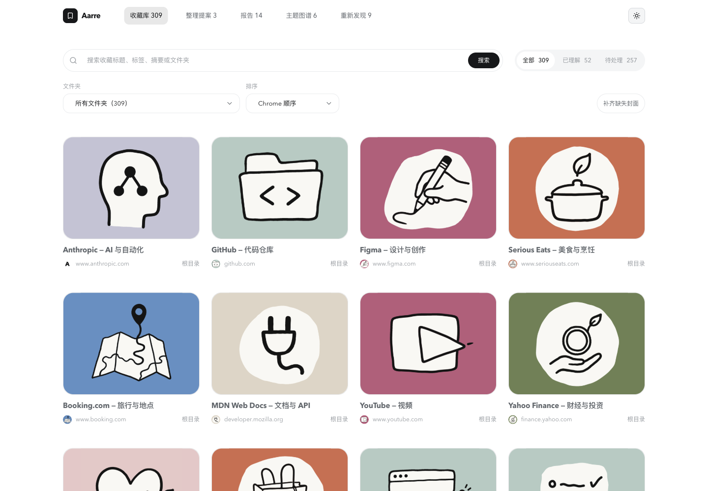
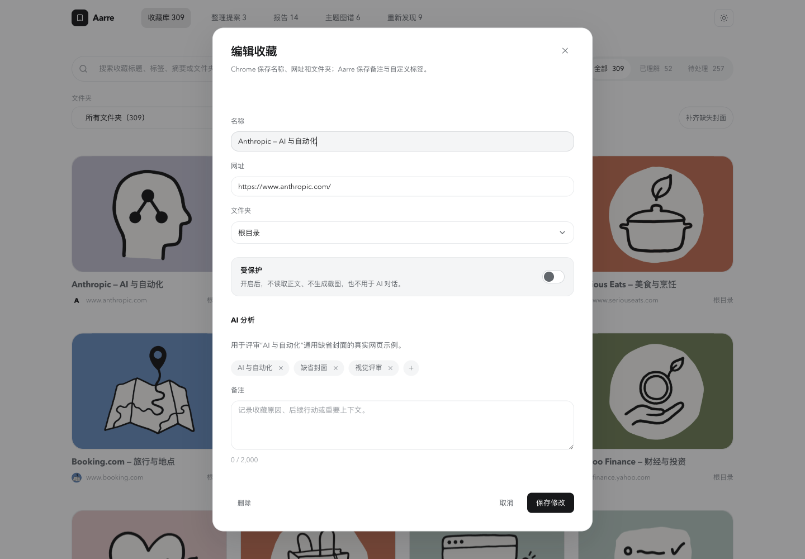
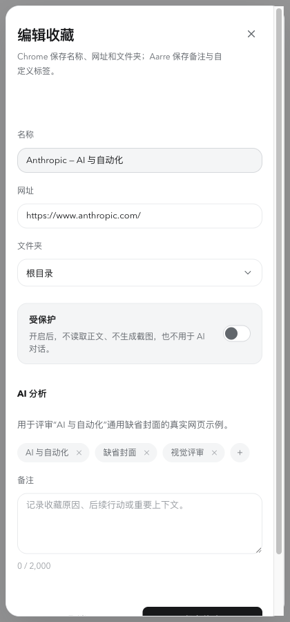
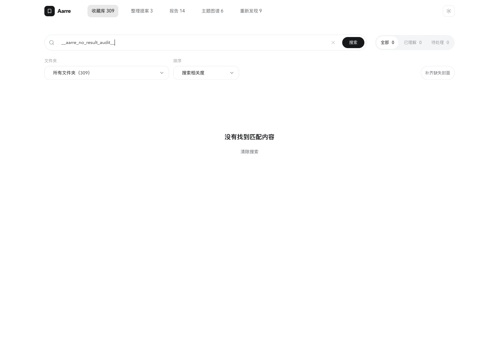
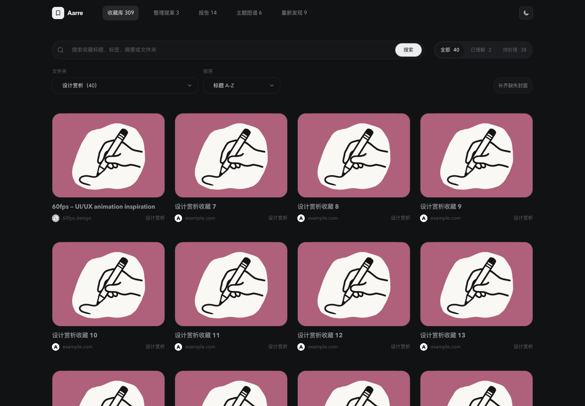
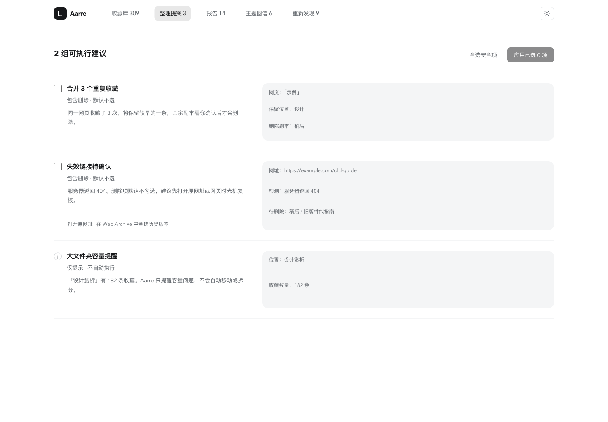
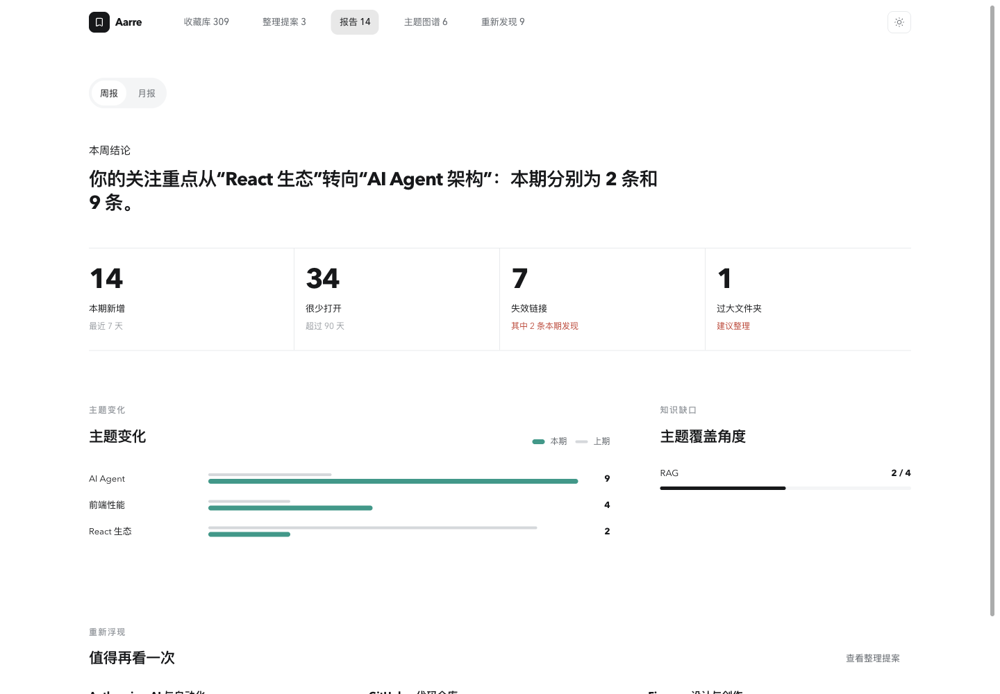
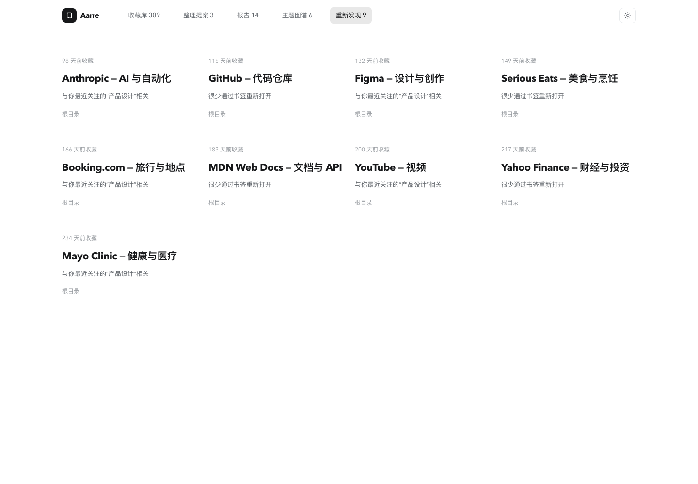

# 2026-09-09 审计证据

主报告：[Aarre 全面审计](../../AUDIT_2026-09-09.md)。当前进展仍以根目录 `AGENT_PROGRESS.md` 顶部为准。

## 内容与边界

- `baseline.json`：本轮 Git、Manifest 版本、后台字节数和 SHA-256。
- `browser-observations.json`：真实浏览器 DOM 样式、几何、筛选排序和键盘抽样记录。
- `screenshots/`：12 张本轮截图，捕获后均打开检查。全部是现有 DEV fixture 界面，不能作为用户安装扩展或生产账号数据的证据。
- `logs/`：本轮命令输出、两份 npm audit JSON、公开隐私政策快照。日志只含本地测试数据、公开内容与代码路径；没有用户凭证。
- `*.cases.ts`：10 个独立故障复现断言，使用真实业务函数与受控依赖。不是假装产品正确的测试；它们明确表达当前尚未满足的行为。

## 复现命令

在仓库根目录、依赖已安装后运行：

```sh
npm exec vitest run -- --config docs/audits/2026-09-09/vitest.config.ts
```

审计基线 `cc352cf` 的预期结果是 **3 个文件、10 个断言失败，退出码 1**。输出中 A01～A10 对应主报告。不能把这些失败改成断言错误行为以“通过”。后续修复时将相应用例完善并迁入正式测试。

这些文件采用 `.cases.ts`，只由独立配置收集，不进入通常的 `*.test.ts` 测试集合。IndexedDB 使用内存替身，网络与 Chrome API 使用隔离替身，不写入真实 Chrome、生产账号或 COS。图片竞争用例的字节仅用于校验上传决策，不涉及图片解码或视觉正确性。

本轮根目录原有 `npm run check` 的 450/451 与这 10 个独立复现结果分别记录，不能相加为同一个标准测试集。

服务端测试使用新建的独立本地 PostgreSQL 数据库 `aarre_audit_20260909`，25 项均通过。不要将测试脚本指向任何已有业务数据库。对象存储是测试替身；没有把这一结果描述为生产 COS 验收。

该隔离测试库保留供后续复跑，只含本轮合成数据。本轮临时 Vite 服务与独立浏览器任务空间已关闭。

## 截图索引

按主报告用户路径排序：

1. [侧栏启动错误](screenshots/01-sidepanel-startup-error.png)
2. [收藏库夜间](screenshots/02-manager-dark.png)、[收藏库日间](screenshots/03-manager-light.png)
3. [桌面编辑弹窗](screenshots/04-edit-dialog-light.png)、[420px 编辑弹窗](screenshots/05-edit-dialog-narrow.png)
4. [420px 收藏库](screenshots/06-manager-narrow.png)
5. [搜索无结果](screenshots/07-search-no-results.png)、[筛选排序与键盘焦点](screenshots/12-filter-sort-keyboard.png)
6. [整理提案](screenshots/08-organize-proposals.png)
7. [报告](screenshots/09-reports.png)
8. [主题图谱](screenshots/10-topic-map.png)
9. [重新发现](screenshots/11-rediscover.png)

## 验证输出

| 检查 | 输出 | 结果 |
| --- | --- | --- |
| 原有标准检查 | [check.txt](logs/check.txt) | 450/451；固定日期撤销用例过期 |
| 生产构建 | [build.txt](logs/build.txt) | 通过；JavaScript 产物语法检查通过 |
| 服务端类型与构建 | [typecheck](logs/server-typecheck.txt)、[build](logs/server-build.txt) | 通过 |
| 服务端 PostgreSQL 集成 | [server-test.txt](logs/server-test.txt) | 25/25 |
| 本轮专项复现 | [reproductions.txt](logs/reproductions.txt) | 10 个应有行为断言失败，缺陷得到复现 |
| 商店素材 | [store-assets.txt](logs/store-assets.txt) | 文件格式通过 |
| 交付 ZIP | [artifacts.txt](logs/artifacts.txt) | 没有 outputs，跳过 |
| 根依赖 | [dependencies.json](logs/dependencies.json) | 5 个受影响依赖条目 |
| 服务端依赖 | [server-dependencies.json](logs/server-dependencies.json) | 3 个受影响依赖条目 |
| 公开政策 | [public-privacy.html](logs/public-privacy.html) | 本轮 GET 公开页面快照 |

本报告未更改产品功能，未执行生产数据修复、账号写入、外部发信或发布操作。

## 逐屏证据与简短注释

<details>
<summary>1. 侧栏启动：阻塞</summary>

开发预览缺少新事件接口，进入错误边界。不是用户安装态截图。


</details>

<details>
<summary>2. 收藏库：可浏览，辅助文字过浅</summary>

日夜主题与手绘资产可正常呈现；域名与目录的可读性需提高。




</details>

<details>
<summary>3. 编辑收藏：可打开关闭，窄窗操作区需精修</summary>

标题自动获焦，字段分组清楚；窄窗内容可滚动，但保存操作初始未完整露出。





</details>

<details>
<summary>4. 窄窗浏览：无整页横向溢出，导航提示不足</summary>

第五个导航项需要横向滚动；工具区占据较多首屏高度。


</details>

<details>
<summary>5. 搜索、筛选、排序：预览抽样通过</summary>

空状态可清除，文件夹过滤 309→40，标题排序改变首项，搜索按钮键盘焦点可见。





</details>

<details>
<summary>6. 整理提案：只读呈现通过，未提交删除</summary>

危险项默认不选，保留/删除目标及原网址复核入口清楚。



</details>

<details>
<summary>7. 报告：结构清楚，辅助字和后续入口需改进</summary>

结论、指标和趋势层次明确；统计是开发 fixture，本轮不据此评价真实分析质量。



</details>

<details>
<summary>8. 主题图谱：缺少键盘与主题收藏入口</summary>

Canvas 图形可呈现，远处标签较淡，需补可操作的等价主题列表。


</details>

<details>
<summary>9. 重新发现：基本可用，信息可读性和反馈可完善</summary>

标题和推荐理由明确；日期、目录偏浅，可考虑已读/稍后反馈。



</details>
